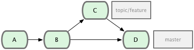

# Git Workshop

!SLIDE

# Git Workshop

!SLIDE left

# Agenda

* Vorstellung
* Git Internals
* Intermediate Git
* Übungen
* Abschluss

*Bei Fragen einfach unterbrechen*

!SLIDE about

# About me

## https://github.com/senny

##### Ruby / Python Developer @ 4teamwork
##### Git seit 6 Jahren
##### Rails Committer
##### Ruvetia Organizer
##### OpenSource Maintainer
* [queue_classic](https://github.com/ryandotsmith/queue_classic)
* [spring](https://github.com/jonleighton/spring)
* [Emacs stuff](http://www.emacswiki.org/emacs/senny)

!SLIDE

# Git Internals

}}} images/clockwork.jpg

!SLIDE left
# Der .git Ordner #

* Konfigurationsdatei (config)
* Hooks
* Index
* Objektdatenbank (objects)
* Referenzen (refs)

!SLIDE
## Objekt Datenbank

!SLIDE image-focus


!SLIDE image-focus


!SLIDE image-focus


!SLIDE image-focus


!SLIDE image-focus


!SLIDE left
## Referenzen

* Pointer auf ein Commit Objekt
* Werden im Ordner .git/refs gespeichert
* Datei mit dem Commit-Hash als Inhalt

!SLIDE

```shell
$ cat .git/refs/heads/master
2d5f0b92c01b3af6b18fa9fd4b9457f28c55f8c9
```

!SLIDE left
## Symbolische Referenzen

* Pointer auf ein Branch oder Commit Objekt
* Werden im Ordner .git/ gespeichert
* Datei mit dem Pfad zum Branch oder Commit-Hash als Inhalt

!SLIDE commandline

## Branch

```shell
$ git checkout master
$ cat .git/HEAD
ref: refs/heads/master
```

## Commit (detached HEAD) ##

```shell
$ git checkout 3ab0946
$ cat .git/HEAD
3ab0946694019e9ec819cddd4999b635449ecc25
```

!SLIDE
# Vorgänge in einem Repository #

!SLIDE image-focus


!SLIDE image-focus


!SLIDE image-focus


!SLIDE image-focus


!SLIDE image-focus


!SLIDE image-focus


!SLIDE image-focus


!SLIDE image-focus


!SLIDE image-focus


!SLIDE
# Commits benennen #

!SLIDE
## SHA-1 Hash

```plain
b645be7a5d01cb5e143fcd2c0581a4dc69c595b9
```

!SLIDE
## Partial SHA-1

```plain
b645be7a5d01cb5e143fcd2c0581a4dc69c59
b645be7a5d01cb5e1
b645be7a5d
b645be7
```

!SLIDE
## Branch, Remote or Tag Name (ref)

```text
origin/master
refs/remotes/origin/master
master
refs/heads/master
v1.0
refs/tags/v1.0
```

!SLIDE
## Carrot Parent

```text
master^
master^2
master^3
```

!SLIDE
## Tilde Spec

```text
master~2
master~3
master~7
```

!SLIDE
## Date Spec (Lokal)

```text
master@{yesterday}
master@{1 month ago}
```

!SLIDE
## Ordinal Spec (Lokal)

```text
master@{1}
master@{5}
```

!SLIDE
## Blob Spec

```text
<treeish>:<path>

master:/path/to/file
my_feature:/app/models/person.rb
release/1.0:/spec/models/person_spec.rb
```

!SLIDE
## Range

```text
<treeish>..<treeish>

7b593b5..51bea1
master..my_feature
```

!SLIDE

# Intermediate Git

}}} images/circuit_board.jpg

!SLIDE left
# Stash

* Aktuelle Arbeiten "zwischenspeichern"
* Äderungen auf einen anderen Branch verschieben
* ermöglich ein Pull bei Änderungen im Working Directory

!SLIDE nolines

```plain
$ git status
 ## master
 M git_intermediate/git_intermediate.md

$ git stash
$ git status
 ## master

$ git stash pop
$ git status
 ## master
 M git_intermediate/git_intermediate.md
```

!SLIDE left
# Blame #

* Wer hat eine bestimmte Zeile geschrieben
* Von wem wurde eine Datei alles verändert
* Wann wurde eine Zeile das letzte Mal verändert
* Zusammengehörigen Code finden (Tests / Implementation)

!SLIDE nolines

```plain
$ git blame daemon.c
979e32fa (Randal L. Schwartz      2005-10-25 16:29:09 -0700    1) #include "cache.h"
85023577 (Junio C Hamano          2006-12-19 14:34:12 -0800    2) #include "pkt-line.h"
77cb17e9 (Michal Ostrowski        2006-01-10 21:12:17 -0500    3) #include "exec_cmd.h"
49ba83fb (Jon Loeliger            2006-09-19 20:31:51 -0500    4) #include "interpolate.h"
f8ff0c06 (Petr Baudis             2005-09-22 11:25:28 +0200    5)
85023577 (Junio C Hamano          2006-12-19 14:34:12 -0800    6) #include <syslog.h>
85023577 (Junio C Hamano          2006-12-19 14:34:12 -0800    7)
695dffe2 (Johannes Schindelin     2006-09-28 12:00:35 +0200    8) #ifndef HOST_NAME_MAX
695dffe2 (Johannes Schindelin     2006-09-28 12:00:35 +0200    9) #define HOST_NAME_MAX 256
695dffe2 (Johannes Schindelin     2006-09-28 12:00:35 +0200   10) #endif
695dffe2 (Johannes Schindelin     2006-09-28 12:00:35 +0200   11)
415e7b87 (Patrick Welche          2007-10-18 18:17:39 +0100   12) #ifndef NI_MAXSERV
415e7b87 (Patrick Welche          2007-10-18 18:17:39 +0100   13) #define NI_MAXSERV 32
415e7b87 (Patrick Welche          2007-10-18 18:17:39 +0100   14) #endif
415e7b87 (Patrick Welche          2007-10-18 18:17:39 +0100   15)
9048fe1c (Petr Baudis             2005-09-24 16:13:01 +0200   16) static int log_syslog;
f8ff0c06 (Petr Baudis             2005-09-22 11:25:28 +0200   17) static int verbose;
1955fabf (Mark Wooding            2006-02-03 20:27:04 +0000   18) static int reuseaddr;
```

!SLIDE left
# Cherry Picking #

* Commits über mehrere Branches verwenden
* Bugfix auf mehrere Releases anwenden
* Nur einen Teil eines Branches verwenden

!SLIDE nolines

## Commit

**$ git cherry-pick 6018dbfa70**

```plain
Finished one cherry-pick.
[test e144b96] Add unit tests for index manipulation
 Author: Vicent Marti <tanoku@gmail.com>
 4 files changed, 209 insertions(+), 0 deletions(-)
```

!SLIDE

## Merge Commit

**$ git cherry-pick -m1 bdeeba1**

```plain
[test be2cee9] Merge pull request #12485 from arunagw/code-removal
 Author: Rafael Mendonça França <rafaelmfranca@gmail.com>
 2 files changed, 35 deletions(-)
 rename actionview/test/{lib => actionpack}/controller/view_paths_test.rb (100%)
 delete mode 100644 actionview/test/lib/controller/fake_controllers.rb
```

!SLIDE left
# Merging #

* Zusammenfügen von zwei oder mehr Branches
* Ein Merge-Commit hat mehr als 1 Parent
* Ein Merge kann rückgänig gemacht werden, wenn man das Merge-Commit
  entfernt

!SLIDE left
## Fast Forward

* Nur wenn Branch nicht divergiert
* kein Merge-Commit
* Branch in der History nicht mehr sichtbar

!SLIDE

**git merge --no-ff topic/feature**


**git merge --ff-only topic/feature**


!SLIDE
# Rebase #

!SLIDE
## Ausgangslage


!SLIDE
## Merge


!SLIDE
## Rebase


!SLIDE image-focus
## Merge (FastForward)


!SLIDE
# Rebase II #

!SLIDE image-focus

## Ausgangslage


!SLIDE

**git rebase --onto master server client**


!SLIDE

**git checkout master && git merge client**


!SLIDE

**git rebase master server**


!SLIDE

**git checkout master && git merge server**


!SLIDE left

# Rebase | Merge #

* NICHT rebasen mit veröffentlichten Commits
* NICHT rebasen bei grossen / umfänglichen Branches
* Merge ist in der History sichtbar (wenn nicht FF)
* Rebase simuliert lineare History
* Rebase --onto um Commits zu verschieben

!SLIDE left

# Reflog #

* Zeichnet Verändernungen an den Branches auf
* Lokal gespeichert / unterschiedlich pro Repository
* Hilfreich bei "rescue missions" ;)

!SLIDE

**git reflog**

```plain

0a620d1 HEAD@{11}: reset: moving to HEAD^
95a9b7d HEAD@{12}: rebase -i (finish): returning to refs/heads/store_accessor_hstore_bug
95a9b7d HEAD@{13}: rebase -i (pick): hstore only allows string keys.
0a620d1 HEAD@{14}: rebase -i (pick): `stored_attributes` need to be specific to a subclass.
d138b71 HEAD@{15}: rebase -i (pick): test to verify the `ActiveRecord::Store` behavior with PG
bdeeba1 HEAD@{16}: checkout: moving from store_accessor_hstore_bug to bdeeba1
a04f344 HEAD@{17}: commit: `stored_attributes` need to be specific to a subclass.
6f7b700 HEAD@{18}: commit: test to verify the `ActiveRecord::Store` behavior with PG's json type
33829ab HEAD@{19}: commit (amend): hstore only allows string keys.
28152cd HEAD@{20}: commit: hstore only allows string keys.
bdeeba1 HEAD@{21}: reset: moving to HEAD^
1986aa9 HEAD@{22}: rebase finished: returning to refs/heads/store_accessor_hstore_bug
1986aa9 HEAD@{23}: rebase: TMP
bdeeba1 HEAD@{24}: checkout: moving from store_accessor_hstore_bug to bdeeba1
94fb685 HEAD@{25}: checkout: moving from master to store_accessor_hstore_bug
bdeeba1 HEAD@{26}: rebase finished: returning to refs/heads/master
bdeeba1 HEAD@{27}: checkout: moving from master to bdeeba1
a0c0c1c HEAD@{28}: checkout: moving from store_accessor_hstore_bug to master
94fb685 HEAD@{29}: rebase finished: returning to refs/heads/store_accessor_hstore_bug
94fb685 HEAD@{30}: rebase: TMP
a0c0c1c HEAD@{31}: checkout: moving from store_accessor_hstore_bug to a0c0c1c
329d9f8 HEAD@{32}: checkout: moving from master to store_accessor_hstore_bug
a0c0c1c HEAD@{33}: checkout: moving from 4-0-stable to master
cfd9186 HEAD@{34}: cherry-pick: Merge pull request #12283 from JuanitoFatas/rails-on-rack
582a90c HEAD@{35}: checkout: moving from master to 4-0-stable
```

!SLIDE

**git reflog --date=relative 4-0-stable**

```plain

1660f53 4-0-stable@{11 minutes ago}: rebase finished: refs/heads/4-0-stable onto 1660f53
8355355 4-0-stable@{2 days ago}: rebase finished: refs/heads/4-0-stable onto 8355355
1366df2 4-0-stable@{3 days ago}: commit (cherry-pick): cleanup changelog entry format.[ci skip]
146132d 4-0-stable@{3 days ago}: rebase finished: refs/heads/4-0-stable onto 146132d
9c98535 4-0-stable@{3 days ago}: rebase finished: refs/heads/4-0-stable onto 9c98535
c3fa44b 4-0-stable@{6 days ago}: rebase finished: refs/heads/4-0-stable onto c3fa44b
cfd9186 4-0-stable@{8 days ago}: cherry-pick: Merge pull request #12283 from Juanito/patch9
582a90c 4-0-stable@{8 days ago}: cherry-pick: Merge pull request #12473 from claudiob/patch1
9f5ec21 4-0-stable@{9 days ago}: cherry-pick: Merge pull request #12463 from ulyssecarion/master
64ba1ab 4-0-stable@{9 days ago}: rebase finished: refs/heads/4-0-stable onto 64ba1ab
faaa57f 4-0-stable@{2 weeks ago}: cherry-pick: Merge pull request #12431 from GRoguelon/master
4135e60 4-0-stable@{2 weeks ago}: cherry-pick: Merge pull request #12430 from vipulnsward/fix
ceaf211 4-0-stable@{2 weeks ago}: rebase finished: refs/heads/4-0-stable onto ceaf21
```

!SLIDE left

# Weitere Informationen

* Man Pages ([http://git-scm.com/docs](http://git-scm.com/docs))
* Git Internals PDF ([http://github.com/pluralsight/git-internals-pdf](http://github.com/pluralsight/git-internals-pdf))
* Pro Git Buch ([http://git-scm.com/book](http://git-scm.com/book))

!SLIDE

# Time to exercise

}}} images/exercise.jpg

!SLIDE

## Ziele

* Alleine oder zu zweit
* Möglichkeiten von Git erkunden
* Man-Pages lesen lernen
* Wissen vertiefen
* Fremdes Git Repository analysieren

!SLIDE nolines

### [Übungen: http://goo.gl/G7y4ql](http://goo.gl/G7y4ql)

**$ git clone https://github.com/senny/git-workshop-rails**

*Die Slides sind auch online verfügbar: [http://senny.github.io/git-workshop](http://senny.github.io/git-workshop)*
